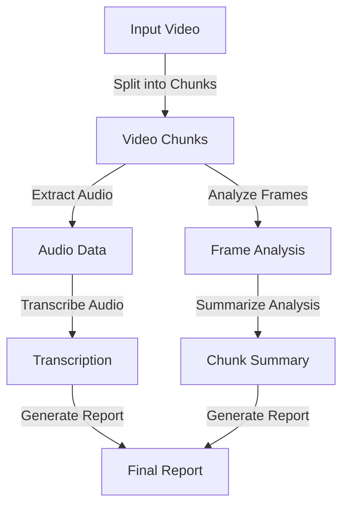

# AI Video Analysis

At a recent tech meetup, I encountered a company in the content creation space that relied on a content manager to manually review videos and ensure that clients needs were met. Although this process is thorough, it poses scalability challenges as the volume of content grows. Automating the analysis could streamline quality control, so I decided to explore how to leverage AI for this purpose. What can i say, I love a good challenge 😎.

## Perquisites
- Python 3.6 or higher
- GPU with CUDA support (optional)
- ffmpeg

## Architecture


## Installation

1. Clone the repository
```bash
  git clone github.com/conceptcodes/ai-video-analysis.git
  cd ai-video-analysis
```

2. Install the required packages
```bash
  pip install -r requirements.txt
```

## Usage

1. Run the script
```bash
  python main.py -v <path_to_video> --txt <path_to_requirements_file>
```

## Roadmap
- [ ] Reduce the number of frames to process
- [ ] Generate report
- [ ] Implement brand asset detection
